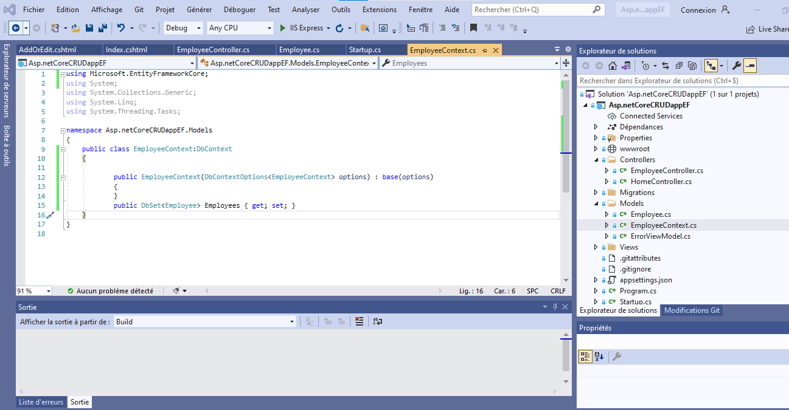
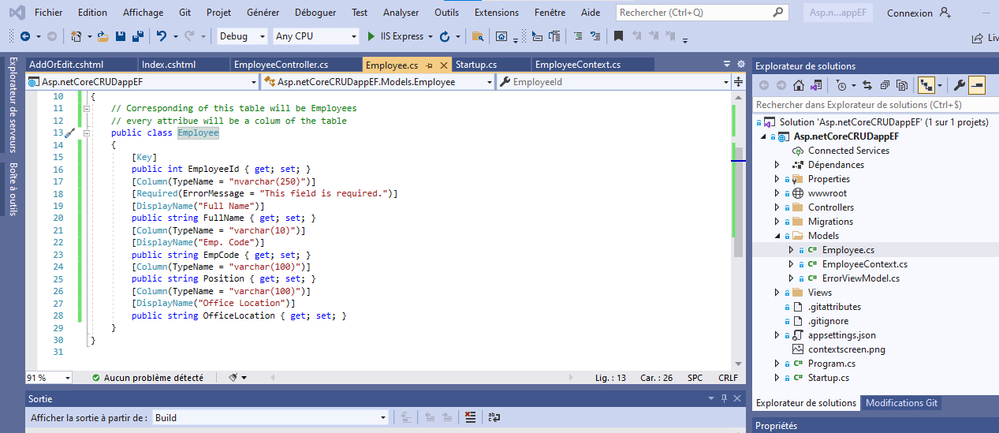
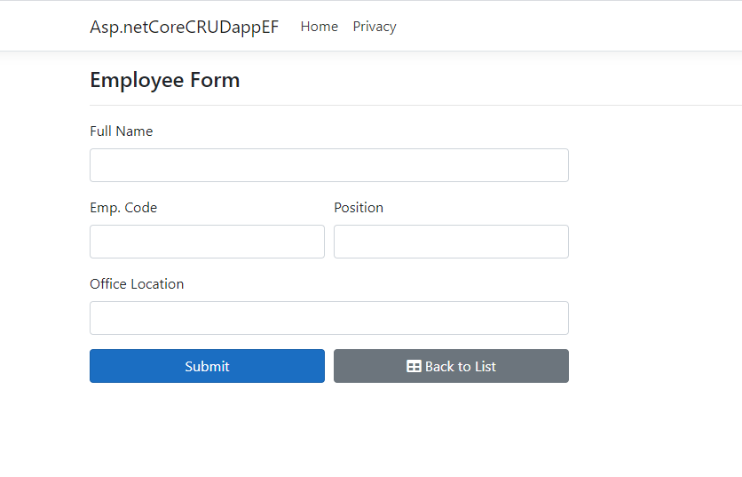
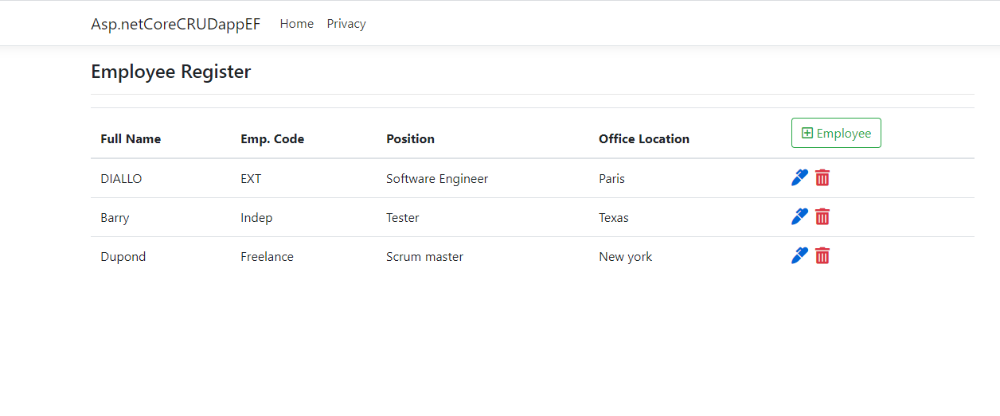

# Asp Net Core MVC Web App CRUD with EF Core Using Code First Approach.
We will build an Asp.Net Core MVC Application using Entity Framework Core to implement CRUD Operations.

### Points discussed:
- Getting started with Asp.Net Core Web App.
- Dependency Injection in Asp.Net Core.
- EF Core CRUD Operations using Code First Approach.

### `Screen shot`
 
 
 
 
 
  
  

  
